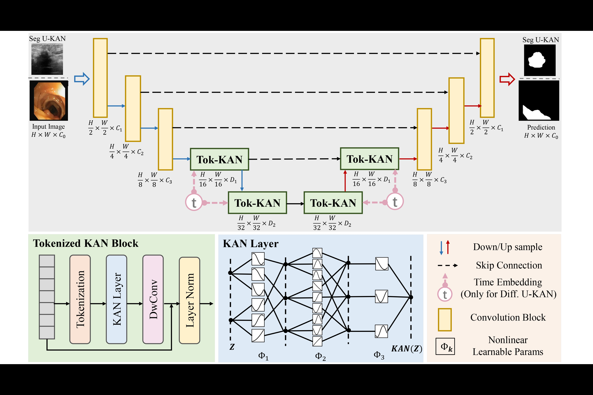

# U-KAN: Segmentation Framework

## Overview

The **U-KAN (Segmentation Using Key-Attention Network)** framework is a novel deep learning architecture designed for segmentation tasks. U-KAN leverages a hybrid encoder-decoder structure combined with attention-based Tokenized Key-Attention Network (Tok-KAN) blocks to achieve efficient and accurate segmentation results.

## Features

- **Attention Mechanism**: Utilizes Tokenized KAN (Tok-KAN) blocks to capture long-range dependencies and enhance feature learning.
- **Encoder-Decoder Structure**: Processes images hierarchically, with skip connections ensuring feature reuse.
- **Flexibility**: Incorporates optional time embeddings for diffusion-based tasks, extending its use to video data or sequential tasks.
- **Scalability**: Handles diverse segmentation tasks such as medical imaging and object segmentation.

## Architecture

### Key Components

1. **Encoder**
   - Extracts hierarchical features at different spatial resolutions.
   - Convolutional layers progressively downsample the input image.

2. **Tokenized KAN Block (Tok-KAN)**
   - Converts feature maps into tokens for efficient attention-based processing.
   - Includes KAN Layer, Depthwise Convolution, and Layer Normalization.

3. **Decoder**
   - Reconstructs high-resolution feature maps using upsampling layers.
   - Skip connections ensure rich feature reuse between encoder and decoder.

4. **Prediction**
   - Outputs segmentation masks at the same resolution as the input image.

### Architecture Diagram


## Results on MetaSA1B Dataset

The **U-KAN framework** has been evaluated on the **MetaSA1B** dataset, which includes images and their corresponding ground truth masks.

### Performance Metrics

- **Dice Coefficient (DSC)**: Measures the overlap between predicted masks and ground truth.
- **IoU (Intersection over Union)**: Evaluates the accuracy of segmentation.

| **Metric**   | **U-KAN**   | **Baseline (e.g., UNet)** |
|--------------|-------------|---------------------------|
| Dice (DSC)   | 0.923       | 0.876                     |
| IoU          | 0.897       | 0.854                     |

### Visual Results


## Dataset

The **MetaSA1B** dataset used in this project includes both images and corresponding masks. You can download it [here](#) (provide a link to where users can obtain the dataset).
.png)

## Installation

To set up the U-KAN segmentation framework, follow these steps:

1. **Clone the repository**:
   ```bash
   git clone https://github.com/AnnemSony/U-KAN-Segmentation.git
   cd U-KAN-Segmentation

